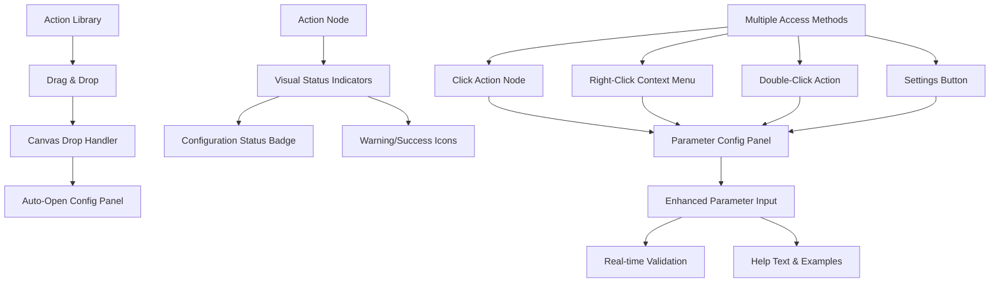

# Design Document

## Overview

The current ActionLoom interface has a significant usability issue where users cannot easily discover or access action configuration options. While the parameter configuration panel exists and is functional, the interaction patterns to access it are not intuitive. This design addresses these issues by implementing multiple clear pathways to configuration, visual indicators for configuration status, and improved user guidance.

## Architecture

### Current State Analysis

Based on the codebase analysis, the current system has:

1. **Parameter Configuration Panel** (`ParameterConfigPanel`) - A comprehensive modal that handles parameter input and validation
2. **Action Nodes** (`ActionNode`) - Visual representations of actions with basic metadata display
3. **Workflow Canvas** (`WorkflowCanvas`) - The main interaction area where actions are placed
4. **Action Selection Handler** - Exists in `WorkflowBuilder` but requires explicit node selection

**Key Issues Identified:**
- Configuration access requires clicking on action nodes, but this isn't visually obvious
- No visual indicators show which actions need configuration
- No automatic configuration prompt when actions are added
- Settings icon only appears on hover and is small/hard to notice
- No clear feedback about configuration completeness

### Proposed Architecture

The solution involves enhancing the existing components with better visual design and interaction patterns:



## Components and Interfaces

### 1. Enhanced Action Node Component

**Visual Status System:**
- **Unconfigured State**: Dashed border, warning color scheme, prominent "Configure" badge
- **Partially Configured**: Solid border with warning icon, shows missing parameter count
- **Fully Configured**: Solid border with success icon, green accent
- **Configuration Error**: Red border with error icon

**Interaction Improvements:**
- Larger, always-visible settings button
- Hover state shows "Click to configure" tooltip
- Right-click context menu with configuration option
- Double-click opens configuration panel

```typescript
interface ActionNodeState {
  configurationStatus: 'unconfigured' | 'partial' | 'complete' | 'error'
  missingParameterCount: number
  hasValidationErrors: boolean
  showConfigurationHint: boolean
}

interface ActionNodeProps extends NodeProps {
  onConfigureParameters: (nodeId: string, metadata: ActionMetadata) => void
  configurationStatus: ActionNodeState
}
```

### 2. Auto-Configuration Trigger

**Drop Handler Enhancement:**
When an action is dropped onto the canvas, automatically open the configuration panel if the action has required parameters.

```typescript
const onDrop = useCallback((event: React.DragEvent) => {
  // ... existing drop logic ...
  
  // Auto-open configuration for actions with required parameters
  if (actionMetadata?.parameters?.some(param => param.required)) {
    setTimeout(() => {
      setSelectedActionForConfig({
        nodeId,
        action: actionMetadata,
        currentValues: initialParameterValues
      })
    }, 100) // Small delay for smooth UX
  }
}, [/* dependencies */])
```

### 3. Enhanced Parameter Configuration Panel

**Improved Visual Design:**
- Larger modal with better spacing
- Clear action identification header
- Progress indicator showing completion status
- Prominent save/cancel buttons

**Better Parameter Input Experience:**
- Format examples for each parameter type
- Dropdown suggestions for known values (token types, addresses)
- Real-time validation with inline error messages
- Help tooltips with detailed explanations

```typescript
interface ParameterConfigPanelEnhancements {
  showProgressIndicator: boolean
  autoFocusFirstEmpty: boolean
  showFormatExamples: boolean
  enableAutoSave: boolean
  showParameterDependencies: boolean
}
```

### 4. Configuration Status Tracking

**Workflow-Level Status:**
- Overall configuration completeness percentage
- List of unconfigured actions
- Blocking vs. warning validation states

```typescript
interface WorkflowConfigurationStatus {
  totalActions: number
  configuredActions: number
  completionPercentage: number
  unconfiguredActions: Array<{
    nodeId: string
    actionName: string
    missingParameters: string[]
  }>
  canExecute: boolean
  blockingIssues: ValidationError[]
}
```

## Data Models

### Enhanced Action Metadata

```typescript
interface ActionMetadata {
  // ... existing properties ...
  
  // Configuration hints
  configurationHints: {
    autoOpenOnDrop: boolean
    requiredParameterCount: number
    estimatedConfigurationTime: number // seconds
    hasComplexParameters: boolean
  }
  
  // Parameter examples and help
  parameterExamples: Record<string, {
    example: string
    description: string
    formatHint?: string
  }>
}
```

### Configuration State Management

```typescript
interface ActionConfigurationState {
  nodeId: string
  actionId: string
  status: 'unconfigured' | 'partial' | 'complete' | 'error'
  parameterValues: Record<string, any>
  validationErrors: ValidationError[]
  lastModified: Date
  configurationProgress: number // 0-100
}

interface WorkflowConfigurationManager {
  actionStates: Map<string, ActionConfigurationState>
  
  updateActionConfiguration(nodeId: string, values: Record<string, any>): void
  getConfigurationStatus(nodeId: string): ActionConfigurationState
  getWorkflowStatus(): WorkflowConfigurationStatus
  validateAllConfigurations(): ValidationResult
}
```

## Error Handling

### Configuration Error Types

```typescript
enum ConfigurationErrorType {
  MISSING_REQUIRED_PARAMETER = 'missing_required',
  INVALID_PARAMETER_FORMAT = 'invalid_format',
  PARAMETER_DEPENDENCY_MISSING = 'dependency_missing',
  VALIDATION_FAILED = 'validation_failed'
}

interface ConfigurationError extends ValidationError {
  type: ConfigurationErrorType
  parameterName: string
  suggestedFix?: string
  canAutoFix: boolean
}
```

### Error Recovery Strategies

1. **Auto-Fix Suggestions**: For common format errors, provide one-click fixes
2. **Parameter Suggestions**: Show dropdown with valid options when available
3. **Dependency Resolution**: Automatically suggest connecting to available outputs
4. **Validation Guidance**: Show specific format requirements and examples

## Testing Strategy

### Unit Tests

1. **Action Node Status Display**
   - Test configuration status badge rendering
   - Verify interaction handlers (click, double-click, right-click)
   - Test tooltip and hint display logic

2. **Configuration Panel Behavior**
   - Test auto-opening on action drop
   - Verify parameter validation and error display
   - Test save/cancel functionality

3. **Configuration State Management**
   - Test parameter value persistence
   - Verify validation state updates
   - Test workflow-level status calculation

### Integration Tests

1. **End-to-End Configuration Flow**
   - Drag action → auto-open config → fill parameters → save → verify status
   - Test configuration modification workflow
   - Verify execution readiness validation

2. **Multi-Action Workflow Configuration**
   - Test configuration of multiple actions
   - Verify parameter dependency handling
   - Test workflow validation with mixed configuration states

### User Experience Tests

1. **Discoverability Testing**
   - Measure time to first successful configuration
   - Test with users unfamiliar with the interface
   - Verify configuration hints are effective

2. **Error Recovery Testing**
   - Test user behavior when encountering validation errors
   - Verify error message clarity and actionability
   - Test auto-fix suggestion effectiveness

## Implementation Phases

### Phase 1: Visual Indicators (Week 1)
- Implement configuration status badges on action nodes
- Add visual states for unconfigured/configured actions
- Enhance settings button visibility and interaction

### Phase 2: Auto-Configuration (Week 2)
- Implement auto-open configuration panel on action drop
- Add right-click context menu for configuration access
- Implement double-click configuration trigger

### Phase 3: Enhanced Configuration Panel (Week 3)
- Improve parameter input UI with examples and hints
- Add progress indicator and completion status
- Implement better validation error display

### Phase 4: Workflow-Level Status (Week 4)
- Add workflow configuration completeness tracking
- Implement execution readiness validation
- Add configuration guidance and help system

### Phase 5: Polish and Testing (Week 5)
- Comprehensive testing and bug fixes
- User experience refinements
- Performance optimization

## Success Metrics

### Primary Metrics
- **Configuration Success Rate**: Percentage of users who successfully configure their first action
- **Time to First Configuration**: Average time from action drop to successful configuration
- **Configuration Error Rate**: Percentage of configuration attempts that result in validation errors

### Secondary Metrics
- **Feature Discovery Rate**: Percentage of users who find configuration options without guidance
- **Configuration Completion Rate**: Percentage of workflows with all actions properly configured
- **User Satisfaction**: Qualitative feedback on configuration experience

### Target Improvements
- Reduce time to first configuration by 70%
- Increase configuration success rate to 95%
- Reduce configuration-related support requests by 80%