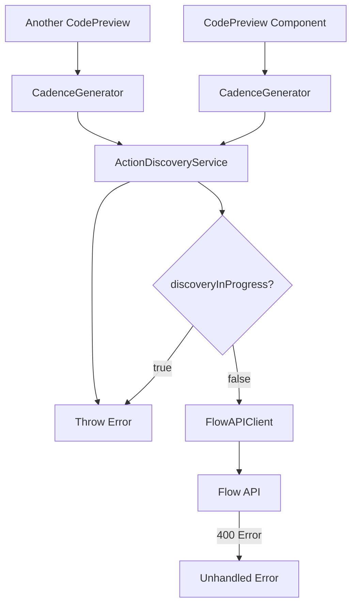
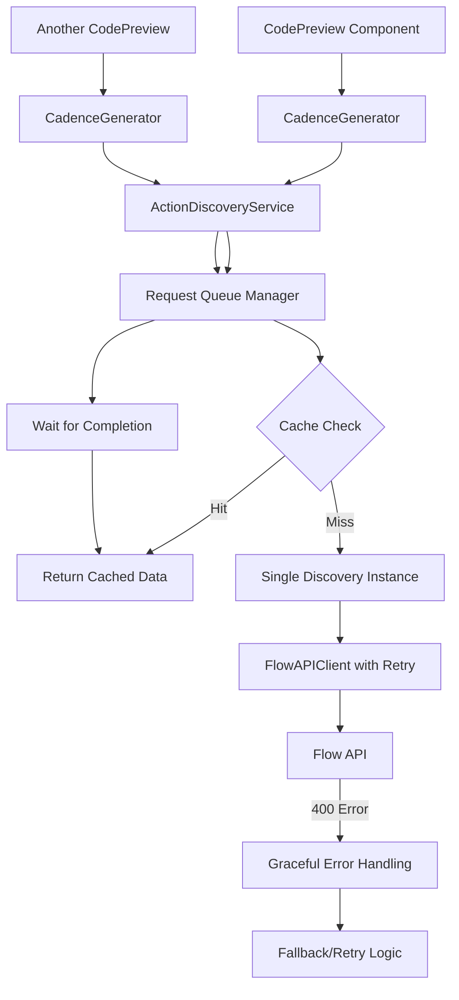

# Design Document

## Overview

This design addresses critical runtime issues in ActionLoom that prevent proper application functionality. The main problems are:

1. **Concurrency Issues**: The ActionDiscoveryService has a simple boolean flag that throws errors when multiple components try to discover actions simultaneously
2. **Hydration Mismatches**: Server-rendered HTML doesn't match client-rendered HTML due to font variable interpolation and dynamic content
3. **API Error Handling**: Flow API client doesn't handle 400 Bad Request errors gracefully, causing cascading failures
4. **Race Conditions**: Multiple CodePreview components trigger simultaneous action discovery requests

## Architecture

### Current Architecture Problems



### Proposed Architecture



## Components and Interfaces

### 1. Enhanced ActionDiscoveryService

**Key Changes:**
- Replace boolean flag with Promise-based queue system
- Implement request deduplication
- Add proper error recovery mechanisms

```typescript
interface DiscoveryRequest {
  id: string
  promise: Promise<DiscoveryResult>
  timestamp: number
  forceRefresh: boolean
}

class ActionDiscoveryService {
  private activeDiscovery: DiscoveryRequest | null = null
  private pendingRequests: Map<string, Promise<DiscoveryResult>> = new Map()
  
  async discoverActions(forceRefresh: boolean = false): Promise<DiscoveryResult>
  private createDiscoveryRequest(forceRefresh: boolean): DiscoveryRequest
  private handleDiscoveryCompletion(request: DiscoveryRequest): void
}
```

### 2. Improved FlowAPIClient Error Handling

**Key Changes:**
- Better 400 error parsing and handling
- Exponential backoff for retries
- Circuit breaker pattern for repeated failures

```typescript
interface APIErrorContext {
  endpoint: string
  method: string
  attempt: number
  lastError?: Error
}

class FlowAPIClient {
  private circuitBreaker: CircuitBreaker
  
  private async makeRequestWithCircuitBreaker(endpoint: string, options: RequestInit): Promise<Response>
  private handleBadRequestError(response: Response, context: APIErrorContext): Promise<never>
  private shouldRetryRequest(error: Error, attempt: number): boolean
}
```

### 3. Hydration-Safe Layout Component

**Key Changes:**
- Use CSS custom properties for font variables
- Implement client-side hydration guards
- Prevent layout shifts during font loading

```typescript
// Enhanced layout with hydration safety
export default function RootLayout({ children }: { children: React.ReactNode }) {
  return (
    <html lang="en" suppressHydrationWarning>
      <body className="font-sans" style={{
        '--font-geist-sans': GeistSans.style.fontFamily,
        '--font-geist-mono': GeistMono.style.fontFamily,
      } as React.CSSProperties}>
        <HydrationBoundary>
          {children}
        </HydrationBoundary>
      </body>
    </html>
  )
}
```

### 4. Request Deduplication Utility

**Purpose:** Prevent duplicate API calls when multiple components request the same data

```typescript
class RequestDeduplicator {
  private activeRequests: Map<string, Promise<any>> = new Map()
  
  async deduplicate<T>(key: string, factory: () => Promise<T>): Promise<T>
  private generateRequestKey(params: any[]): string
  private cleanup(key: string): void
}
```

## Data Models

### Enhanced Error Types

```typescript
interface ActionDiscoveryError extends Error {
  code: 'DISCOVERY_IN_PROGRESS' | 'API_ERROR' | 'NETWORK_ERROR' | 'TIMEOUT'
  retryable: boolean
  context?: Record<string, any>
}

interface CircuitBreakerState {
  state: 'CLOSED' | 'OPEN' | 'HALF_OPEN'
  failureCount: number
  lastFailureTime: number
  nextAttemptTime: number
}
```

### Request Queue Models

```typescript
interface QueuedRequest<T> {
  id: string
  resolve: (value: T) => void
  reject: (error: Error) => void
  timestamp: number
  timeout: NodeJS.Timeout
}

interface DiscoveryMetrics {
  totalRequests: number
  cacheHits: number
  cacheMisses: number
  averageResponseTime: number
  errorRate: number
}
```

## Error Handling

### 1. Graceful Degradation Strategy

```typescript
class GracefulErrorHandler {
  async handleDiscoveryError(error: ActionDiscoveryError): Promise<DiscoveryResult> {
    switch (error.code) {
      case 'DISCOVERY_IN_PROGRESS':
        return this.waitForCompletion()
      case 'API_ERROR':
        return this.tryFallbackSources()
      case 'NETWORK_ERROR':
        return this.returnCachedData()
      default:
        return this.returnEmptyResult()
    }
  }
}
```

### 2. Circuit Breaker Implementation

```typescript
class CircuitBreaker {
  private state: CircuitBreakerState = {
    state: 'CLOSED',
    failureCount: 0,
    lastFailureTime: 0,
    nextAttemptTime: 0
  }
  
  async execute<T>(operation: () => Promise<T>): Promise<T>
  private shouldAllowRequest(): boolean
  private onSuccess(): void
  private onFailure(): void
}
```

### 3. Hydration Error Prevention

```typescript
// Client-side hydration boundary
function HydrationBoundary({ children }: { children: React.ReactNode }) {
  const [isHydrated, setIsHydrated] = useState(false)
  
  useEffect(() => {
    setIsHydrated(true)
  }, [])
  
  if (!isHydrated) {
    return <div suppressHydrationWarning>{children}</div>
  }
  
  return <>{children}</>
}
```

## Testing Strategy

### 1. Unit Tests
- ActionDiscoveryService concurrency handling
- FlowAPIClient error scenarios
- Circuit breaker state transitions
- Request deduplication logic

### 2. Integration Tests
- End-to-end action discovery flow
- Multiple component interaction scenarios
- Error recovery and fallback mechanisms
- Cache consistency across requests

### 3. Load Tests
- Concurrent request handling
- Memory leak detection
- Performance under high load
- Circuit breaker effectiveness

### 4. Hydration Tests
- Server-client HTML matching
- Font loading consistency
- Dynamic content rendering
- Browser extension compatibility

## Performance Considerations

### 1. Caching Strategy
- In-memory cache for active sessions
- Redis cache for persistent storage
- Cache invalidation on network switches
- Stale-while-revalidate pattern

### 2. Request Optimization
- Batch API requests where possible
- Implement request coalescing
- Use compression for large responses
- Minimize redundant network calls

### 3. Memory Management
- Clean up completed requests
- Implement cache size limits
- Use weak references where appropriate
- Monitor for memory leaks

## Security Considerations

### 1. API Key Management
- Secure storage of API keys
- Rate limiting per key
- Key rotation support
- Environment-based configuration

### 2. Error Information Disclosure
- Sanitize error messages for production
- Log detailed errors server-side only
- Prevent sensitive data leakage
- Implement proper error boundaries

## Monitoring and Observability

### 1. Metrics Collection
- Request success/failure rates
- Response time percentiles
- Cache hit ratios
- Circuit breaker state changes

### 2. Logging Strategy
- Structured logging with context
- Error correlation IDs
- Performance timing logs
- User action tracking

### 3. Health Checks
- API endpoint availability
- Cache connectivity
- Circuit breaker status
- Overall system health