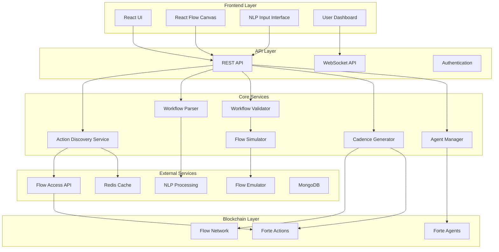
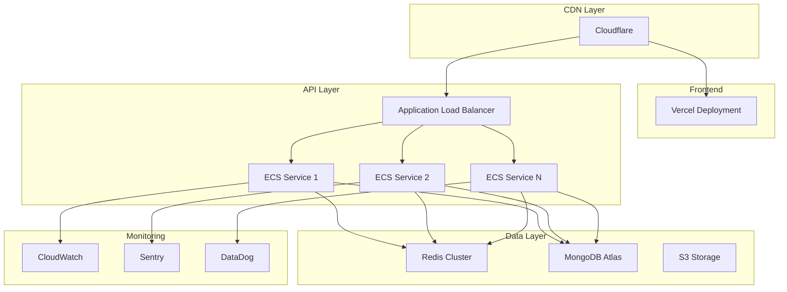

# Design Document

## Overview

This design document outlines the architecture for integrating ActionLoom with Flow's Forte upgrade, transforming it from a static workflow builder into a dynamic, AI-ready blockchain automation platform. The design builds upon the existing React Flow-based visual interface while adding dynamic Action discovery, natural language processing, advanced simulation, and Agent-based automation.

The integration will maintain backward compatibility with the current system while adding new capabilities that leverage Forte's standardized Actions and Agents.

## Architecture

### High-Level System Architecture



### Component Architecture

#### 1. Action Discovery Service

**Purpose**: Dynamically discover and cache available Actions from Flow's on-chain registries.

**Key Components**:
- **Registry Scanner**: Queries Flow Access API for Action registries
- **Metadata Parser**: Extracts and validates Action metadata (inputs, outputs, parameters)
- **Cache Manager**: Manages Redis caching with TTL and invalidation
- **Search Engine**: Provides semantic search using vector embeddings or keyword matching

**Data Flow**:
1. Periodic scanning of on-chain Action registries
2. Metadata extraction and validation
3. Caching in Redis with structured format
4. Real-time search and filtering for UI

#### 2. Enhanced Natural Language Processing

**Purpose**: Parse natural language inputs into structured workflow definitions.

**Key Components**:
- **Intent Classifier**: Identifies workflow intentions using transformer models
- **Entity Extractor**: Extracts parameters, amounts, tokens, and addresses
- **Action Mapper**: Maps parsed intents to discovered Actions
- **Validation Engine**: Validates extracted parameters against Action schemas

**Implementation**:
```typescript
interface NLPResult {
  confidence: number
  steps: ParsedStep[]
  ambiguities: Ambiguity[]
  suggestions: string[]
}

interface ParsedStep {
  actionId: string
  actionName: string
  parameters: Record<string, any>
  confidence: number
}
```

#### 3. Advanced Workflow Validation System

**Purpose**: Comprehensive validation and simulation of workflow chains.

**Key Components**:
- **Type Checker**: Validates input/output type compatibility between Actions
- **Resource Analyzer**: Ensures proper resource lifecycle management
- **Simulation Engine**: Off-chain execution using Flow emulator
- **Gas Estimator**: Calculates gas costs and balance requirements

**Validation Pipeline**:
1. Static analysis of Action compatibility
2. Resource safety verification
3. Off-chain simulation with mock data
4. Gas estimation and balance checking
5. Security audit of generated Cadence

#### 4. Agent-Based Automation System

**Purpose**: Deploy and manage automated workflow execution using Forte Agents.

**Key Components**:
- **Agent Factory**: Creates Agent resources with scheduling logic
- **Schedule Manager**: Handles recurring and event-driven execution
- **Event Monitor**: Integrates with oracle Actions for triggers
- **Execution Tracker**: Monitors Agent performance and failures

**Agent Architecture**:
```cadence
pub resource Agent {
    pub let workflowId: String
    pub let schedule: Schedule
    pub let triggers: [EventTrigger]
    
    pub fun execute() {
        // Execute workflow logic
    }
    
    pub fun updateSchedule(newSchedule: Schedule) {
        // Update execution schedule
    }
}
```

## Components and Interfaces

### 1. Action Discovery API

```typescript
interface ActionMetadata {
  id: string
  name: string
  description: string
  category: string
  version: string
  inputs: ActionInput[]
  outputs: ActionOutput[]
  parameters: ActionParameter[]
  compatibility: CompatibilityInfo
  gasEstimate: number
  securityLevel: SecurityLevel
}

interface DiscoveryService {
  discoverActions(): Promise<ActionMetadata[]>
  searchActions(query: string): Promise<ActionMetadata[]>
  getActionById(id: string): Promise<ActionMetadata | null>
  refreshCache(): Promise<void>
}
```

### 2. Natural Language Processing API

```typescript
interface NLPService {
  parseWorkflow(input: string): Promise<NLPResult>
  extractEntities(text: string): Promise<Entity[]>
  validateParameters(step: ParsedStep, action: ActionMetadata): ValidationResult
  suggestCorrections(input: string, errors: string[]): Promise<string[]>
}

interface Entity {
  type: 'token' | 'amount' | 'address' | 'action'
  value: string
  confidence: number
  position: [number, number]
}
```

### 3. Workflow Validation API

```typescript
interface ValidationService {
  validateWorkflow(workflow: ParsedWorkflow): Promise<ValidationResult>
  simulateExecution(workflow: ParsedWorkflow): Promise<SimulationResult>
  checkCompatibility(actions: ActionMetadata[]): CompatibilityResult
  estimateGas(workflow: ParsedWorkflow): Promise<GasEstimate>
}

interface SimulationResult {
  success: boolean
  gasUsed: number
  balanceChanges: BalanceChange[]
  events: Event[]
  errors: SimulationError[]
  warnings: string[]
}
```

### 4. Agent Management API

```typescript
interface AgentService {
  createAgent(workflow: ParsedWorkflow, schedule: Schedule): Promise<string>
  updateAgent(agentId: string, updates: AgentUpdate): Promise<void>
  deleteAgent(agentId: string): Promise<void>
  getAgentStatus(agentId: string): Promise<AgentStatus>
  listUserAgents(userId: string): Promise<AgentInfo[]>
}

interface Schedule {
  type: 'recurring' | 'event-driven' | 'one-time'
  interval?: number // seconds for recurring
  cronExpression?: string
  eventTriggers?: EventTrigger[]
  startTime?: Date
  endTime?: Date
}
```

## Data Models

### Enhanced Action Model

```typescript
interface ForteAction extends Action {
  // Existing fields from current Action interface
  id: string
  name: string
  description: string
  category: string
  inputs: ActionInput[]
  outputs: ActionOutput[]
  
  // New Forte-specific fields
  version: string
  contractAddress: string
  metadata: ActionMetadata
  compatibility: CompatibilityInfo
  gasEstimate: number
  securityAudit: SecurityAudit
  dependencies: string[]
  tags: string[]
}

interface CompatibilityInfo {
  requiredCapabilities: string[]
  supportedNetworks: string[]
  minimumFlowVersion: string
  conflictsWith: string[]
}
```

### Workflow Model Extensions

```typescript
interface EnhancedWorkflow extends ParsedWorkflow {
  // Existing fields
  actions: ParsedAction[]
  executionOrder: string[]
  rootActions: string[]
  metadata: WorkflowMetadata
  
  // New fields
  nlpSource?: string // Original natural language input
  validationResults: ValidationResult
  simulationResults?: SimulationResult
  agentConfig?: AgentConfiguration
  securityLevel: SecurityLevel
  estimatedGas: number
  requiredBalance: TokenBalance[]
}

interface AgentConfiguration {
  schedule: Schedule
  eventTriggers: EventTrigger[]
  retryPolicy: RetryPolicy
  notifications: NotificationConfig
  permissions: Permission[]
}
```

### Event and Trigger Models

```typescript
interface EventTrigger {
  type: 'price' | 'time' | 'balance' | 'custom'
  condition: TriggerCondition
  oracleAction?: string // Action ID for oracle data
  parameters: Record<string, any>
}

interface TriggerCondition {
  operator: 'gt' | 'lt' | 'eq' | 'gte' | 'lte'
  value: any
  tolerance?: number
}
```

## Error Handling

### Comprehensive Error Management

```typescript
enum ErrorType {
  DISCOVERY_ERROR = 'DISCOVERY_ERROR',
  PARSING_ERROR = 'PARSING_ERROR',
  VALIDATION_ERROR = 'VALIDATION_ERROR',
  SIMULATION_ERROR = 'SIMULATION_ERROR',
  EXECUTION_ERROR = 'EXECUTION_ERROR',
  AGENT_ERROR = 'AGENT_ERROR',
  NETWORK_ERROR = 'NETWORK_ERROR'
}

interface ActionLoomError {
  type: ErrorType
  code: string
  message: string
  details: Record<string, any>
  suggestions: string[]
  recoverable: boolean
  timestamp: Date
}
```

### Error Recovery Strategies

1. **Discovery Failures**: Fallback to cached data, retry with exponential backoff
2. **Parsing Errors**: Provide suggestions, highlight problematic text
3. **Validation Failures**: Show specific issues, suggest fixes
4. **Simulation Errors**: Detailed error context, parameter adjustment suggestions
5. **Agent Failures**: Automatic retry with circuit breaker pattern

## Testing Strategy

### 1. Unit Testing

- **Action Discovery**: Mock Flow API responses, test caching logic
- **NLP Processing**: Test parsing accuracy with diverse inputs
- **Workflow Validation**: Test compatibility checking and simulation
- **Cadence Generation**: Verify generated code correctness

### 2. Integration Testing

- **End-to-End Workflows**: Test complete user journeys
- **Flow Emulator Integration**: Test simulation accuracy
- **Agent Deployment**: Test scheduling and execution
- **API Endpoints**: Test all REST and WebSocket endpoints

### 3. Performance Testing

- **Load Testing**: 100+ concurrent users, complex workflows
- **Stress Testing**: High-frequency Agent executions
- **Cache Performance**: Redis performance under load
- **Database Performance**: MongoDB query optimization

### 4. Security Testing

- **Input Sanitization**: Test against injection attacks
- **Cadence Security**: Audit generated smart contracts
- **Authentication**: Test API security and access controls
- **Resource Safety**: Verify no resource leaks in generated code

## Deployment Architecture

### Production Infrastructure



### Scalability Considerations

1. **Horizontal Scaling**: ECS services with auto-scaling groups
2. **Database Sharding**: MongoDB sharding for workflow storage
3. **Cache Distribution**: Redis cluster for Action metadata
4. **CDN Optimization**: Static asset delivery via Cloudflare
5. **API Rate Limiting**: Redis-based rate limiting for AI agents

## Security Considerations

### 1. Input Security
- Comprehensive input sanitization for all user inputs
- NLP input validation to prevent prompt injection
- Parameter validation against Action schemas

### 2. Cadence Security
- Integration with Flow's security analysis tools
- Resource safety verification in generated code
- Gas limit enforcement to prevent DoS attacks

### 3. Agent Security
- Role-based access control for Agent deployment
- Secure key management for automated executions
- Audit logging for all Agent activities

### 4. API Security
- JWT-based authentication for API endpoints
- Rate limiting and DDoS protection
- Secure API key management for AI agents

This design provides a comprehensive foundation for implementing the Forte integration while maintaining the existing ActionLoom functionality and ensuring scalability, security, and reliability.