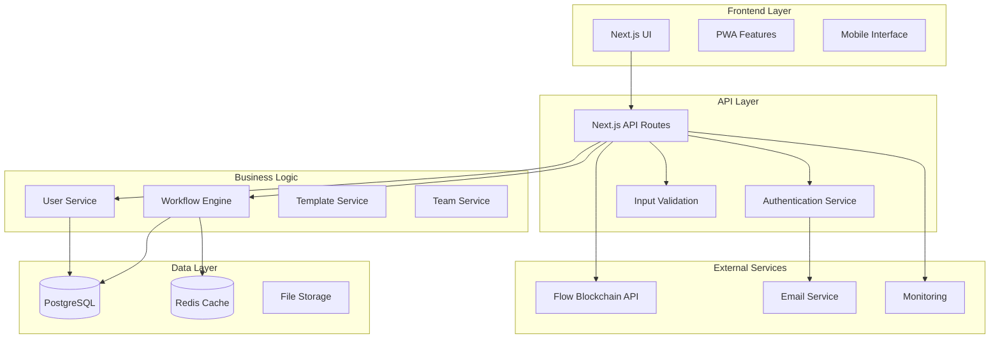

# Design Document

## Overview

This design document outlines the architecture and implementation approach for transforming ActionLoom into a production-ready application. The design focuses on scalability, security, maintainability, and user experience while building upon the existing Next.js foundation.

## Architecture

### System Architecture



### Database Schema Design

**Users Table:**
- id (UUID, Primary Key)
- wallet_address (String, Optional, Unique)
- email (String, Optional, Unique)
- password_hash (String, Optional)
- name (String)
- avatar_url (String, Optional)
- email_verified (Boolean)
- primary_auth_method (Enum: wallet, email)
- created_at (Timestamp)
- updated_at (Timestamp)

**Workflows Table:**
- id (UUID, Primary Key)
- user_id (UUID, Foreign Key)
- name (String)
- description (Text, Optional)
- workflow_data (JSONB)
- is_template (Boolean)
- is_public (Boolean)
- tags (String Array)
- created_at (Timestamp)
- updated_at (Timestamp)

**Teams Table:**
- id (UUID, Primary Key)
- name (String)
- description (Text, Optional)
- owner_id (UUID, Foreign Key)
- created_at (Timestamp)

**Team_Members Table:**
- team_id (UUID, Foreign Key)
- user_id (UUID, Foreign Key)
- role (Enum: member, admin, owner)
- joined_at (Timestamp)

**Workflow_Executions Table:**
- id (UUID, Primary Key)
- workflow_id (UUID, Foreign Key)
- user_id (UUID, Foreign Key)
- status (Enum: pending, running, completed, failed)
- transaction_hash (String, Optional)
- execution_data (JSONB)
- started_at (Timestamp)
- completed_at (Timestamp, Optional)

## Components and Interfaces

### Authentication System

**Authentication System:**
- **Primary:** Flow wallet authentication with signature verification
- **Secondary:** Email/password authentication for non-Web3 users
- **OAuth providers:** Google, GitHub for additional convenience
- **JWT token management** for session handling
- **Wallet linking:** Connect multiple wallets to one account

**Security Features:**
- Password hashing with bcrypt
- Rate limiting for login attempts
- CSRF protection
- Secure session cookies
- Email verification

### User Management Service

```typescript
interface UserService {
  createUser(userData: CreateUserData): Promise<User>
  authenticateUser(email: string, password: string): Promise<User | null>
  updateUserProfile(userId: string, updates: UserUpdates): Promise<User>
  deleteUser(userId: string): Promise<void>
  verifyEmail(token: string): Promise<boolean>
  resetPassword(email: string): Promise<void>
}
```

### Workflow Management Service

```typescript
interface WorkflowService {
  saveWorkflow(userId: string, workflow: WorkflowData): Promise<Workflow>
  getWorkflows(userId: string, filters?: WorkflowFilters): Promise<Workflow[]>
  getWorkflow(workflowId: string, userId: string): Promise<Workflow | null>
  updateWorkflow(workflowId: string, updates: WorkflowUpdates): Promise<Workflow>
  deleteWorkflow(workflowId: string, userId: string): Promise<void>
  executeWorkflow(workflowId: string, userId: string): Promise<ExecutionResult>
}
```

### Template System

```typescript
interface TemplateService {
  getTemplates(category?: string, tags?: string[]): Promise<Template[]>
  createTemplate(userId: string, workflowId: string): Promise<Template>
  publishTemplate(templateId: string): Promise<void>
  useTemplate(templateId: string, userId: string): Promise<Workflow>
  rateTemplate(templateId: string, userId: string, rating: number): Promise<void>
}
```

## Data Models

### Core Data Structures

```typescript
interface User {
  id: string
  walletAddress?: string
  email?: string
  name: string
  avatarUrl?: string
  emailVerified: boolean
  primaryAuthMethod: 'wallet' | 'email'
  createdAt: Date
  updatedAt: Date
}

interface Workflow {
  id: string
  userId: string
  name: string
  description?: string
  workflowData: WorkflowData
  isTemplate: boolean
  isPublic: boolean
  tags: string[]
  createdAt: Date
  updatedAt: Date
}

interface WorkflowExecution {
  id: string
  workflowId: string
  userId: string
  status: ExecutionStatus
  transactionHash?: string
  executionData: any
  startedAt: Date
  completedAt?: Date
}

interface Team {
  id: string
  name: string
  description?: string
  ownerId: string
  members: TeamMember[]
  createdAt: Date
}

interface TeamMember {
  userId: string
  role: 'member' | 'admin' | 'owner'
  joinedAt: Date
}
```

## Error Handling

### Error Classification System

```typescript
enum ErrorType {
  VALIDATION_ERROR = 'VALIDATION_ERROR',
  AUTHENTICATION_ERROR = 'AUTHENTICATION_ERROR',
  AUTHORIZATION_ERROR = 'AUTHORIZATION_ERROR',
  BLOCKCHAIN_ERROR = 'BLOCKCHAIN_ERROR',
  DATABASE_ERROR = 'DATABASE_ERROR',
  EXTERNAL_SERVICE_ERROR = 'EXTERNAL_SERVICE_ERROR',
  INTERNAL_ERROR = 'INTERNAL_ERROR'
}

interface AppError {
  type: ErrorType
  message: string
  code: string
  details?: any
  timestamp: Date
}
```

### Error Handling Strategy

- **Client-side:** Toast notifications for user errors, error boundaries for component failures
- **API-level:** Structured error responses with appropriate HTTP status codes
- **Database-level:** Transaction rollbacks and connection retry logic
- **Blockchain-level:** Gas estimation failures and transaction timeout handling

## Testing Strategy

### Testing Pyramid

**Unit Tests (70%):**
- Service layer functions
- Utility functions
- Component logic
- Database models

**Integration Tests (20%):**
- API endpoint testing
- Database integration
- External service mocking
- Workflow execution flows

**End-to-End Tests (10%):**
- Critical user journeys
- Workflow creation and execution
- Authentication flows
- Payment processing

### Testing Tools

- **Jest** for unit testing
- **React Testing Library** for component testing
- **Playwright** for E2E testing
- **Supertest** for API testing
- **Test containers** for database testing

## Performance Optimization

### Caching Strategy

**Redis Caching:**
- User session data (TTL: 24 hours)
- Workflow metadata (TTL: 1 hour)
- Template listings (TTL: 30 minutes)
- Blockchain data (TTL: 5 minutes)

**Database Optimization:**
- Proper indexing on frequently queried fields
- Connection pooling with pgBouncer
- Read replicas for analytics queries
- Partitioning for large tables

**Frontend Optimization:**
- Next.js static generation for public pages
- Image optimization and lazy loading
- Code splitting and dynamic imports
- Service worker for offline functionality

### Monitoring and Observability

**Application Monitoring:**
- **Sentry** for error tracking and performance monitoring
- **DataDog** or **New Relic** for APM
- **Prometheus** + **Grafana** for custom metrics
- **LogRocket** for user session replay

**Infrastructure Monitoring:**
- **AWS CloudWatch** for infrastructure metrics
- **Uptime monitoring** for service availability
- **Database performance monitoring**
- **CDN performance tracking**

## Security Considerations

### Data Protection

- **Encryption at rest:** Database encryption for sensitive data
- **Encryption in transit:** HTTPS/TLS for all communications
- **PII handling:** Proper anonymization and data retention policies
- **Backup security:** Encrypted backups with access controls

### Application Security

- **Input validation:** Comprehensive validation on all inputs
- **SQL injection prevention:** Parameterized queries and ORM usage
- **XSS protection:** Content Security Policy and input sanitization
- **CSRF protection:** Anti-CSRF tokens for state-changing operations

### Blockchain Security

- **Transaction validation:** Multi-layer validation before execution
- **Gas limit protection:** Automatic gas estimation and limits
- **Contract verification:** Verification of smart contract authenticity
- **Wallet security:** Secure wallet connection and session management

## Deployment Architecture

### Infrastructure Components

**Application Tier:**
- **AWS ECS** or **Kubernetes** for container orchestration
- **Application Load Balancer** for traffic distribution
- **Auto Scaling Groups** for horizontal scaling
- **Health checks** and **rolling deployments**

**Database Tier:**
- **AWS RDS PostgreSQL** with Multi-AZ deployment
- **Redis ElastiCache** for caching
- **Automated backups** and **point-in-time recovery**
- **Database monitoring** and **performance insights**

**Storage Tier:**
- **AWS S3** for file storage and static assets
- **CloudFront CDN** for global content delivery
- **Image optimization** and **compression**

### CI/CD Pipeline

**Build Pipeline:**
1. Code commit triggers build
2. Run unit and integration tests
3. Security scanning (SAST/DAST)
4. Dependency vulnerability scanning
5. Build Docker images
6. Push to container registry

**Deployment Pipeline:**
1. Deploy to staging environment
2. Run E2E tests
3. Performance testing
4. Security validation
5. Deploy to production with blue-green strategy
6. Post-deployment monitoring

## Scalability Considerations

### Horizontal Scaling

- **Stateless application design** for easy horizontal scaling
- **Database read replicas** for read-heavy workloads
- **Microservices architecture** for independent scaling
- **Event-driven architecture** for loose coupling

### Performance Targets

- **Page load time:** < 2 seconds for 95th percentile
- **API response time:** < 500ms for 95th percentile
- **Database query time:** < 100ms for 95th percentile
- **Concurrent users:** Support 10,000+ concurrent users
- **Workflow executions:** Handle 1,000+ executions per minute

This design provides a comprehensive foundation for building ActionLoom into a production-ready application that can scale to serve thousands of users while maintaining security, performance, and reliability standards.