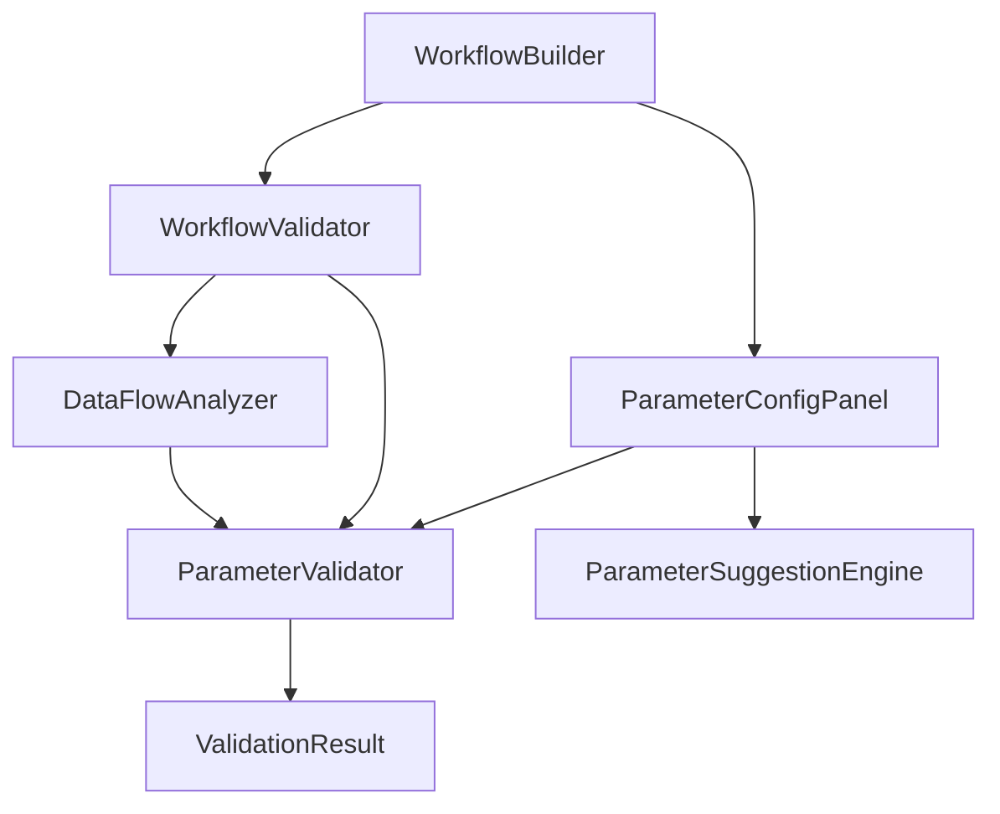

# Design Document

## Overview

The workflow parameter validation system will provide comprehensive parameter configuration, validation, and user guidance for ActionLoom workflows. This system will ensure that all action parameters are properly configured before workflow execution, preventing the validation errors users are currently experiencing.

## Architecture

### Core Components

1. **ParameterValidator** - Validates parameter values against action metadata
2. **ParameterConfigPanel** - UI component for configuring action parameters
3. **WorkflowValidator** - Validates entire workflows before execution
4. **ParameterSuggestionEngine** - Provides smart defaults and suggestions
5. **DataFlowAnalyzer** - Analyzes parameter dependencies between actions

### Component Interactions



## Components and Interfaces

### ParameterValidator

```typescript
interface ParameterValidator {
  validateParameter(
    parameter: ActionParameter,
    value: any,
    context: ValidationContext
  ): ParameterValidationResult
  
  validateAllParameters(
    action: ActionMetadata,
    parameterValues: Record<string, any>
  ): ActionValidationResult
}

interface ParameterValidationResult {
  isValid: boolean
  errors: ValidationError[]
  warnings: string[]
  suggestions?: string[]
}

interface ValidationContext {
  workflow: ParsedWorkflow
  currentAction: ParsedAction
  availableOutputs: Record<string, ActionOutput>
}
```

### ParameterConfigPanel

```typescript
interface ParameterConfigPanelProps {
  action: ActionMetadata
  currentValues: Record<string, any>
  onParameterChange: (parameterName: string, value: any) => void
  onValidationChange: (isValid: boolean, errors: ValidationError[]) => void
  availableOutputs: Record<string, ActionOutput>
}

interface ParameterInputProps {
  parameter: ActionParameter
  value: any
  onChange: (value: any) => void
  validation: ParameterValidationResult
  suggestions: string[]
}
```

### WorkflowValidator

```typescript
interface WorkflowValidator {
  validateWorkflow(workflow: ParsedWorkflow): WorkflowValidationResult
  validateAction(action: ParsedAction, context: ValidationContext): ActionValidationResult
  checkDataFlowIntegrity(workflow: ParsedWorkflow): DataFlowValidationResult
}

interface WorkflowValidationResult {
  isValid: boolean
  actionResults: Record<string, ActionValidationResult>
  dataFlowResult: DataFlowValidationResult
  globalErrors: ValidationError[]
}
```

## Data Models

### Enhanced Parameter Types

```typescript
interface EnhancedActionParameter extends ActionParameter {
  validation: ParameterValidationRules
  suggestions?: ParameterSuggestion[]
  dependencies?: ParameterDependency[]
  defaultValue?: any
}

interface ParameterValidationRules {
  required: boolean
  type: ParameterType
  constraints?: ParameterConstraints
  customValidator?: (value: any, context: ValidationContext) => ValidationResult
}

interface ParameterConstraints {
  min?: number
  max?: number
  pattern?: RegExp
  enum?: string[]
  decimals?: number
}

interface ParameterSuggestion {
  value: any
  label: string
  description?: string
  category?: string
}

interface ParameterDependency {
  sourceActionId: string
  sourceOutputName: string
  transformFunction?: (value: any) => any
}
```

### Validation Results

```typescript
interface ActionValidationResult {
  actionId: string
  isValid: boolean
  missingParameters: string[]
  invalidParameters: Record<string, ParameterValidationResult>
  warnings: string[]
}

interface DataFlowValidationResult {
  isValid: boolean
  circularDependencies: string[]
  unresolvedReferences: UnresolvedReference[]
  typeCompatibilityIssues: TypeCompatibilityIssue[]
}

interface UnresolvedReference {
  actionId: string
  parameterName: string
  referencedAction: string
  referencedOutput: string
}

interface TypeCompatibilityIssue {
  sourceAction: string
  sourceOutput: string
  targetAction: string
  targetParameter: string
  sourceType: string
  targetType: string
  canConvert: boolean
}
```

## Error Handling

### Validation Error Types

1. **Missing Required Parameters** - Clear indication of which parameters need values
2. **Invalid Parameter Values** - Specific feedback about what's wrong and how to fix it
3. **Type Mismatches** - Guidance on data type compatibility between connected actions
4. **Circular Dependencies** - Detection and prevention of infinite loops in parameter references
5. **Unreachable Actions** - Identification of actions that can't execute due to missing dependencies

### User-Friendly Error Messages

```typescript
const ERROR_MESSAGES = {
  MISSING_REQUIRED: (param: string) => `${param} is required and must be provided`,
  INVALID_TYPE: (param: string, expected: string, actual: string) => 
    `${param} expects ${expected} but received ${actual}`,
  INVALID_FORMAT: (param: string, format: string) => 
    `${param} must be in ${format} format`,
  OUT_OF_RANGE: (param: string, min: number, max: number) => 
    `${param} must be between ${min} and ${max}`,
  CIRCULAR_DEPENDENCY: (actions: string[]) => 
    `Circular dependency detected: ${actions.join(' → ')}`
}
```

## Testing Strategy

### Unit Tests

1. **ParameterValidator Tests**
   - Test all parameter types and validation rules
   - Test edge cases and boundary conditions
   - Test custom validation functions

2. **WorkflowValidator Tests**
   - Test complete workflow validation scenarios
   - Test data flow analysis and dependency detection
   - Test circular dependency detection

3. **ParameterSuggestionEngine Tests**
   - Test suggestion generation for different parameter types
   - Test context-aware suggestions
   - Test default value population

### Integration Tests

1. **End-to-End Validation Flow**
   - Test parameter configuration through UI
   - Test real-time validation feedback
   - Test workflow execution with valid parameters

2. **Error Handling Scenarios**
   - Test various validation failure scenarios
   - Test error message clarity and helpfulness
   - Test recovery from validation errors

### Component Tests

1. **ParameterConfigPanel Tests**
   - Test parameter input rendering for different types
   - Test validation feedback display
   - Test suggestion integration

2. **Workflow Builder Integration**
   - Test parameter panel integration with workflow canvas
   - Test validation state synchronization
   - Test execution prevention when validation fails

## Implementation Considerations

### Performance

- Debounce real-time validation to avoid excessive computation
- Cache validation results for unchanged parameters
- Use incremental validation for large workflows

### User Experience

- Progressive disclosure of advanced parameter options
- Clear visual indicators for validation states
- Contextual help and documentation for complex parameters

### Extensibility

- Plugin system for custom parameter types
- Configurable validation rules per action type
- Support for dynamic parameter schemas based on other parameter values